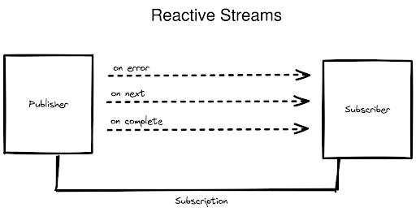

# Reactive programming

## Términos que debes conocer

Conceptos importantes de la programación reactiva:

- Asynchronous Data Stream: Un flujo de datos que emite valores de a uno por vez con un retraso entre ellos se conoce como flujo de datos asincrónico. Según la definición de la palabra "asincrónico", los datos que se liberan pueden surgir en cualquier momento, como después de un segundo o incluso dos minutos.
- Producer: El productor actúa como una fuente de datos y siempre publicará eventos.
- Subscriber: El suscriptor esencialmente "escucha" los eventos del productor. El suscriptor se suscribe y consume esos eventos.
- Processor: Entre el publicador y el suscriptor, un procesador actúa como intermediario. Un profesor primero se suscribe a un publicador. Luego, un suscriptor se suscribe a un procesador.
- Stream: Es una serie de eventos que se ordenan en el tiempo. Un flujo puede emitir tres tipos diferentes de señales: un valor (un valor de un tipo determinado), un error o una señal completada.
- Reactive Stream: El procesamiento de flujo asincrónico con contrapresión no bloqueante es el objetivo del proyecto comunitario Reactive Streams, que se fundó en 2013. El objetivo era especificar una colección de protocolos, métodos e interfaces que se puedan utilizar para expresar los procesos y entidades esenciales.

## Qué es "Reactive programming"

La programación reactiva, o Reactive Programming, es un paradigma enfocado en el trabajo con flujos de datos finitos o infinitos de manera asíncrona, permitiendo que estos datos se propaguen generando cambios en la aplicación, es decir, “reaccionan” a los datos ejecutando una serie de eventos.

La programación reactiva está relacionada con el patrón de diseño Observer: cuando hay un cambio de estado en un objeto, los otros objetos son notificados y actualizados acorde. Por lo tanto, en lugar de sondear eventos para los cambios, los eventos se realizan de forma asíncrona para que los observadores puedan procesarlos.

Utilizando programación asíncrona, la idea es simple: disminuir el uso ineficiente de recursos usando recursos que, de lo contrario, estarían inactivos, ya que permanecen a la espera de actividad de algún componente. Los nuevos datos se notifican a los clientes en vez de tener que solicitarlos, debido a que la entrada y salida de datos es asíncrona. Por ello se invierte el diseño normal del procesamiento de entrada y salida. Este enfoque libera al cliente para hacer otras cosas mientras espera nuevas notificaciones.

Es importante entender el significado de reactivo para entender el paradigma de programación reactiva. Reaccionar significa una forma de respuesta, pero ¿a qué reaccionamos? Reaccionamos a eventos, esto significa que reactivo es una respuesta a un evento. De esta manera, podemos definir la programación reactiva como un método de programación impulsado por eventos.

La programación reactiva es un paradigma de programación donde el foco está en desarrollar aplicaciones asincrónicas y no bloqueantes en una forma impulsada por eventos.

## Manifiesto Reactivo

La programación reactiva es un paso hacia un sistema reactivo. Dado que la programación reactiva y los sistemas reactivos son un concepto tan amplio y desafiante, un grupo de desarrolladores ha elaborado un manifiesto al respecto. En 2013, se creó el Manifiesto Reactivo con el fin de explicar los principios básicos de la programación reactiva. Hay cuatro características fundamentales que debe tener un sistema reactivo:

- Responsivos: aseguran la calidad del servicio cumpliendo unos tiempos de respuesta establecidos. Además define límites en dichos tiempos de respuesta, de forma que los problemas pueden ser detectados rápidamente y tratados de forma efectiva
- Resilientes: se mantienen responsivos incluso cuando se enfrentan a situaciones de error.
- Elásticos: se mantienen responsivos incluso ante aumentos en la carga de trabajo.
- Orientados a mensajes: minimizan el acoplamiento entre componentes al establecer interacciones basadas en el intercambio de mensajes de manera asíncrona. Afectando (de manera positiva) todo el sistema.

## Reactor project

La biblioteca reactiva, Project Reactor, es una biblioteca de aplicaciones sin bloqueo para la máquina virtual Java (JVM) que se deriva de la especificación Reactive Streams. La biblioteca Project Reactor sirve como base para la pila reactiva dentro del ecosistema Spring y su desarrollo se lleva a cabo en estrecha colaboración con Spring.

## Especificación de flujos reactivos

La especificación de flujos reactivos es un conjunto de reglas o especificaciones que debe seguir al diseñar un flujo reactivo. Los ingenieros de software de empresas de gran reputación como Netflix, Twitter, etc., se reunieron y presentaron estas especificaciones.

Estas especificaciones presentan cuatro interfaces que se deben usar y anular al crear un flujo reactivo.

- Publisher
Esta es una interfaz de método único que se usará para registrar al subscriber en el publisher. El método subscribe de esta interfaz acepta el objeto subscriber y lo registra.

- Subscriber
Esta es una interfaz que tiene cuatro métodos
El publisher llamará al método onSubscribe cuando se suscriba al objeto Subscribe
El método onNext se llamará cuando se publiquen los próximos datos para el subscriber
El método onError se llamará cuando surjan excepciones durante la publicación de datos para el suscriptor
El método onComplete se llamará después de que se complete con éxito la publicación de datos para el suscriptor

- Subscription
Esta es una interfaz con dos métodos. El objeto de subscription se creará cuando el usuario se suscriba al editor en el objeto de editor como se explicó anteriormente. El objeto de suscripción se pasará al objeto de suscriptor a través del método onSubscribe.
El método request se llamará cuando el suscriptor necesite solicitar datos al editor.
El método cancel se llamará cuando el suscriptor necesite cancelar y cerrar la suscripción.

- Procesador
Esta es una interfaz que se extiende tanto por las interfaces de editor como de suscriptor. Esta interfaz no es muy común, pero se utilizará para procesar la lógica del flujo de trabajo de suscripción y publicación.
